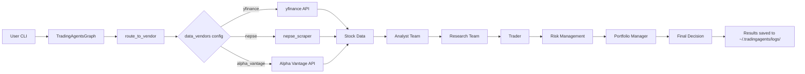

# How TradingAgents Works

A simple explanation of how AI agents analyze stocks and make trading decisions.

## The Big Picture

Think of TradingAgents like a **stock trading company** with different departments. Each department (agent) does a specific job, then they all share info to make a final decision.

```
User Input (CLI/API)
        │
        ▼
┌─────────────────────────────┐
│     TradingAgents Graph      │
│                             │
│  ┌─────────────────────────┐ │
│  │  1. Analyst Team        │ │  ← Collects data & analysis
│  │     (4 analysts)        │ │
│  └────────────┬──────────────┘ │
│              │              │
│  ┌───────────▼──────────────┐ │
│  │  2. Research Team       │ │  ← Debates & decides strategy
│  │   (Bull vs Bear)        │ │
│  └────────────┬──────────────┘ │
│              │              │
│  ┌───────────▼──────────────┐ │
│  │  3. Trader              │ │  ← Creates investment plan
│  └────────────┬──────────────┘ │
│              │              │
│  ┌───────────▼──────────────┐ │
│  │  4. Risk Management     │ │  ← Checks risks
│  │   (3 risk profiles)     │ │
│  └────────────┬──────────────┘ │
│              │              │
│  ┌───────────▼──────────────┐ │
│  │  5. Portfolio Manager   │ │  ← Final BUY/SELL/HOLD decision
│  └─────────────────────────┘ │
└─────────────────────────────┘
        │
        ▼
   Final Decision
```

## Step-by-Step Flow

### Step 1: You Provide Input

```bash
python -m cli.main --ticker CYCL --vendor nepse
```

This tells the system:
- **What** to analyze (CYCL stock)
- **Where** to get data (NEPSE via nepse-scraper)

### Step 2: Analyst Team (4 Agents)

Each agent looks at data from a different angle:

| Agent | Job | What it looks at |
|-------|-----|------------------|
| Market Analyst | Price trends | OHLCV data, moving averages |
| Social Analyst | Social sentiment | Social media trends |
| News Analyst | News impact | Recent news & events |
| Fundamentals Analyst | Company health | Financial statements |

**Analogy:** Like 4 doctors examining a patient - one checks heart, another checks lungs, etc.

```
Analyst Team
├── Market Analyst ──► "Stock price: NPR 1470, down 7.5%"
├── Social Analyst ──► "Limited data for NEPSE"
├── News Analyst ──► "No news available"
└── Fundamentals ──► "Microfinance sector, rural focus"
```

### Step 3: Research Team (Bull vs Bear Debate)

Two researchers debate, then a manager decides:

```
Bull Researcher: "RSI is oversold, good time to buy"
        │
        ▼
    Research Manager ──► "BUY signal confirmed"
        │
Bear Researcher: "Below moving averages, risky"
```

**Analogy:** Like a debate team arguing opposite sides, then a judge decides.

### Step 4: Trader Creates Plan

Based on research decision, the trader creates an investment plan:

```
Research Decision: "BUY signal"
        │
        ▼
Trader Plan: "Buy 1000 shares at NPR 1470, stop loss at 1400"
```

### Step 5: Risk Management (3 Profiles)

Three risk analysts evaluate the plan:

| Analyst | Risk Style | Response |
|---------|------------|----------|
| Aggressive | High risk, high reward | "Approve, potential 15% gain" |
| Neutral | Moderate | "Approve with caution" |
| Conservative | Low risk | "Reject, too volatile" |

**Analogy:** Like your family discussing an investment - dad says go big, mom says be careful, sister says wait.

### Step 6: Portfolio Manager (Final Decision)

The manager reviews everything and makes the final call:

```
Market Report: BUY ✓
Research Plan: Buy 1000 shares ✓
Risk Analysis: 2 approve, 1 reject
        │
        ▼
Final Decision: BUY ✓
```

## Data Flow (How Data Moves)



## The Config System (How You Choose Data Source)

```python
# This tells the system WHERE to get data
config["data_vendors"] = {
    "core_stock_apis": "nepse",     # Stock prices from NEPSE
    "technical_indicators": "nepse", # Technical analysis from NEPSE
}
```

**Analogy:** Like choosing which database to query - MySQL vs MongoDB vs NEPSE.

## Complete Example

```bash
# Run analysis (use full path to Python)
/home/alembershreesh/miniconda3/bin/python -m cli.main --ticker CYCL --vendor nepse
```

Or add alias to `~/.bashrc`:
```bash
alias ta='/home/alembershreesh/miniconda3/bin/python -m cli.main'
# Then run: ta --ticker CYCL --vendor nepse
```

**What happens inside:**

1. CLI receives ticker="CYCL", vendor="nepse"
2. Config set to use NEPSE data source
3. TradingAgentsGraph initialized
4. Agents run in sequence:
   - Market Analyst fetches CYCL data from NEPSE
   - Technical Analyst calculates RSI, MACD, etc.
   - Research Team debates
   - Trader creates plan
   - Risk team evaluates
   - Portfolio Manager decides
5. Results saved to `~/.tradingagents/logs/CYCL/<date>/`

## What Gets Saved

```
~/.tradingagents/logs/CYCL/2026-05-09/
├── complete_report.md      # Everything in one file
├── 1_analysts/             # Each analyst's report
├── 2_research/             # Debate & decision
├── 3_trading/              # Investment plan
├── 4_risk/                 # Risk evaluation
├── 5_portfolio/           # Final decision
└── message_tool.log       # Full conversation log
```

## Key Concepts

| Term | Meaning |
|------|---------|
| **Agent** | AI that does one specific job |
| **Graph** | System that connects all agents |
| **Vendor** | Data source (yfinance, NEPSE, etc.) |
| **propagate** | Run the full analysis pipeline |
| **route_to_vendor** | Function that picks correct data source |

## Simple Summary

```
You run CLI → Config sets data source → Agents analyze → 
Research debates → Trader plans → Risk checks → 
Portfolio decides → Results saved
```

Each agent is a simple function that takes input and produces output. The "graph" orchestrates them in sequence, passing data from one to the next.